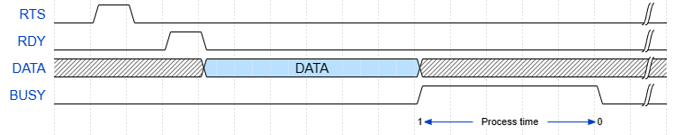

# ZephC LTE Gateway
update and backup repo.

## Quick access
- [GPIO infomations](#status-port)<br>
- [Communications port](#communications-port)<br>
- [Data frame](#rs485-data-frame)<br>
- [Waveform](#waveform)<br>


### Processor
- STM32F411EC (ARM Cortex M4)
- Freq. : 72 MHz
- RAM : 128 KB
- FLASH : 512 KB

### Software
- STM32CubeUDE

### Debuger/Programmer
- STlink *(require)*

### Status port
| Pin name | Pin descriptins | Port | Pin | Mode |
| :-- | :-- | :-: | :-- | :--
Debug | general purpose output port for test <br> *normally not used* | B | 1 | OUTPUT |
BUSY | for tell other device now gateway is busy | B | 5 | OUTPUT |
ONLINE | for tell other device now gateway is online or offline | B | 6 | OUTPUT |
RDY | for tell other device now gateway is ready to receive data | B | 7 | OUTPUT |
RTS | for tell gateway wait to receive data | B | 3 | INPUT *Interrupt* |
ERROR | if system have error | B | 9 | OUTPUT |


### Communications port
***UART1*** - used for communicate between **gateway and master** via UART to ***RS485***
| Descriptions | setting |
| :-- | :-- |
Baud rate | 9600 |
Word length | 8 bit |
Parity | None |
Stop bit | 1 |

| Pin descriptins | Port | Pin |
| :-- | :-: | :-- |
Tx | A | 9 |
Rx | A | 10 |


***UART2*** - used for communicate between **gateway and LTE module** via UART
| Descriptions | setting |
| :-- | :-- |
Baud rate | 115200 |
Word length | 8 bit |
Parity | None |
Stop bit | 1 |

| Pin descriptins | Port | Pin |
| :-- | :-: | :-- |
Tx | A | 2 |
Rx | A | 3 |

***USB (VCOM)*** - used for debug only  
*you can used any serial terminal software and baud rate*
| Pin descriptins | Port | Pin |
| :-- | :-: | :-- |
USB DP | A | 12 |
USB DM | A | 11 |


### RS485 Data frame

Gateway not process any data from master, Do only split and pass through data only
| **Name** | REQ. NODE | HH/MM/SS | DD/MM/YY | BOX ID | X | Y | Z | HUMI | TEMP | MQ3 |CO2 | AIRFLOW | Q
| --- | :-: | :-: | :-: | :-: | :-: | :-: | :-: | :-: | :-: | :-: | :-: | :-: |:-: |
| **Data type** | Str | Str | Str |Str | Str | Str | Str | Str | Str | Str | Str | Str | Str |


#### ***ex :*** 
```
[Valid data]
A,20:2:0,29/11/23,A,4.36,3.41,2.47,91.6,12.1,1.14,976,599,Q  

[Fail/Empty data]
B,,,,,,,,,,,,
```

### Data list push to server


| No. | Data | info/response code |
| :-- | :-- | :-- |
1 | GPS current latitude |
2 | GPS current longitude |
3 | GPS Status | *0 - GPS not valid<br> 1 - GPS valid<br> 2 - Use previous data from memory*
4 | Sensor_ID_n|
5 | Sensor_n_Status | 0 - No data<br> 1 - Data valid |
6 | Sensor_n_time stamped |
7 | Sensor_n_date stamped |
8 | Sensor_n_X |
9 | Sensor_n_Y |
10 | Sensor_n_Z |
11 | Sensor_n_HUIM |
12 | Sensor_n_TEMP |
13 | Sensor_n_MQ3 |
14 | Sensor_n_CO2 |
15 | Sensor_n_AIR FLOW |

*n = A,B,C,D,E,...*  


## Waveform

<br>timing diagram receive data from RS485<br>